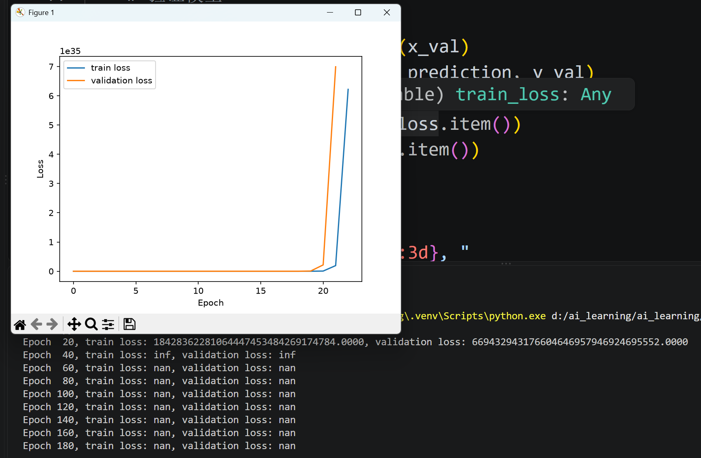
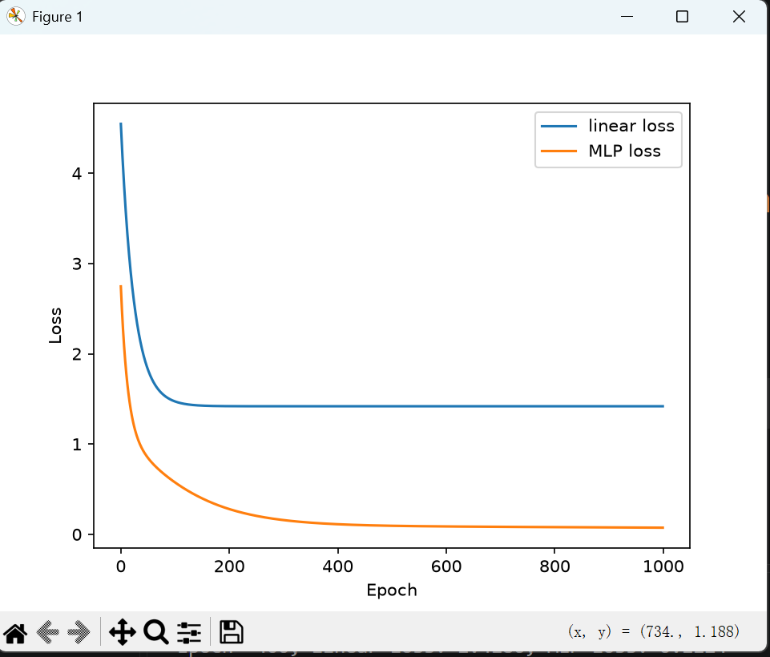
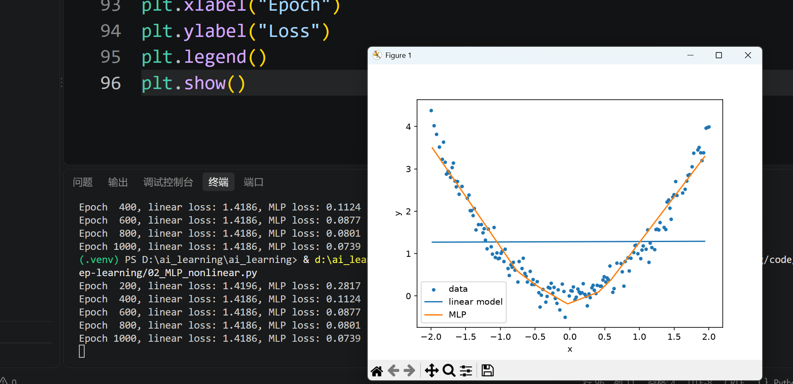

# 机器学习基础概念

## 线性回归与逻辑回归

- 线性回归用于预测连续的数值，例如房价、温度和考试分数。
- 逻辑回归主要用于分类问题，例如判断邮件是否为垃圾邮件。
- 逻辑回归通常先输出属于某一类的概率，再根据阈值进行分类。

## 特征、标签和模型参数

- 特征：输入给模型、用于进行预测的信息，例如年龄、收入和负债情况。
- 标签：模型希望预测的真实结果，例如是否会贷款违约。
- 模型参数：模型在训练过程中学习得到的数值，主要包括权重和偏置。
- 权重表示不同特征对预测结果的影响程度。

## 损失函数

- 损失函数用于衡量模型预测结果与真实标签之间的差异。
- 损失越小，通常说明模型的预测越接近真实结果。
- 线性回归常用均方误差，分类问题常用交叉熵损失。

## 梯度下降

- 梯度表示损失函数相对于模型参数的变化方向和变化程度。
- 梯度下降根据梯度和学习率调整模型参数，使损失逐渐减小。

## PyTorch 训练过程

1. 前向传播：将特征输入模型，得到预测结果。
2. 计算损失：使用损失函数计算预测结果与真实标签之间的差异。
3. 清除旧梯度：清除上一轮计算留下的梯度。
4. 反向传播：根据损失计算每个模型参数的梯度。
5. 更新参数：优化器根据梯度和学习率更新模型参数。
6. 重复以上过程，使模型逐渐学会数据中的规律。

## 神经元与激活函数
- 神经元是用来处理特征的最小单元，会给特征乘上一个权值并加上偏置
- 激活函数可以使神经网络处理非线性的问题
1. ReLU用于隐藏层
2. Softmax,Sigmoid用于输出层
- 多层感知机制：输出层--隐藏层--ReUL--隐藏层--Softmax/Sigmoid--输出层

## 向前传播
- 用于预测结果

## 反向传播
- 计算出损失值之后进行算出各个参数的梯度，后进行修改参数
- 会计算出每一个参数的梯度，并且修改每一个参数

## 更新参数
- 参数更新公式：新参数=旧参数-梯度*学习率

## 过拟合与欠拟合
- 过拟合：训练太多，模型记住了训练集，训练集的损失减少，但测试集损失在增大
- 欠拟合：模型训练太少，训练集与测试集表现都不够好

## 减少过拟合的方法
1. 增加数据，模型不会简单的记住训练集
2. 减少层数，神经元数量或参数量
3. 正则化，在损失函数中加入对复杂参数的惩罚
4. Dropout,在每次训练的时候随机关闭几个神经元
5. 验证集表现不再变好的时候停止训练

## 学习率实验
- 在一个简单的PyTorch实验中，将学习率进行修改，可以得到差异很大的结果
- 如图，学习率太大（0.1），模型学习的步子迈的太大，导致参数要么太大，要么太小，始终得不到想要的结果

## MLP
- 在隐藏层之间加入激活函数（如：ReUL等），使模型能够进行非线性的预测
- ReLU用于非线性预测的原理： \
h₁ = ReLU(x) \
h₂ = ReLU(x - 1) \
输出 = h₁ - 2h₂
根据输出函数的图像可得他会有一个转折点，而多个ReUL就会形成更细致的转折点，拟合成曲线
- 用pytorch做一个简单的实验：分别让线性模型与MLP学习 y = x²+噪声，结果如图

- 线性模型最后趋近于一条直线，且损失值最后基本不变
- MLP则近似拟合出一条抛物线，损失值也在不断下降
- 这体现了ReLU具有预测非线性关系的能力